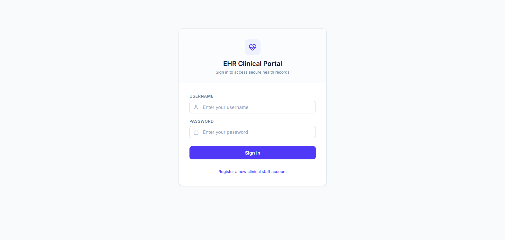
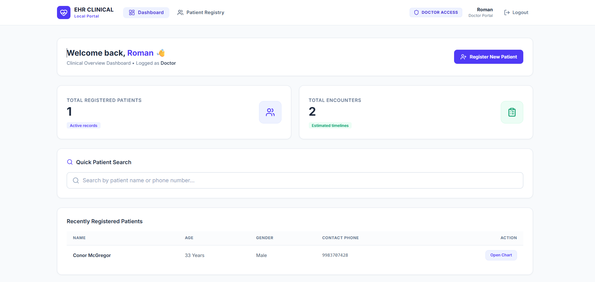
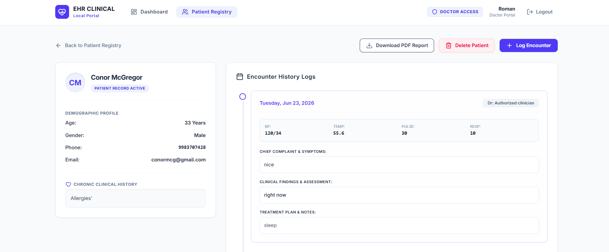

# 🏥 EHR System – Electronic Health Record Management Platform

A full-stack Electronic Health Record (EHR) Management System built using the MERN Stack. The platform enables healthcare organizations to securely manage patient records, medical encounters, authentication, and role-based access control through a modern and responsive user interface.

## 🚀 Live Demo

🌐 Frontend: https://ehr-system-xi.vercel.app

⚙️ Backend API: https://ehr-system-9e0d.onrender.com

---

## 📌 Project Overview

The EHR System is designed to digitize healthcare record management by providing a centralized platform for storing and accessing patient information.

Healthcare professionals can:

* Register and manage patient records
* Record patient encounters and medical history
* Access secure healthcare data
* Authenticate using JWT-based authentication
* Use role-based access control for different user types

---

## ✨ Key Features

### 🔐 Authentication & Security

* JWT Authentication
* Secure Password Hashing using Bcrypt
* Protected API Routes
* Persistent User Sessions

### 👨‍⚕️ User Management

* Doctor Accounts
* Receptionist Accounts
* Role-Based Access Control (RBAC)

### 🏥 Patient Management

* Register New Patients
* Update Patient Information
* View Patient Records
* Maintain Medical History

### 📋 Medical Encounter Management

* Create Patient Encounters
* Record Diagnoses
* Treatment Documentation
* Clinical Notes Storage

### 🎨 Modern UI

* Responsive Design
* Clean Dashboard Layout
* User-Friendly Interface
* Tailwind CSS Styling

---

## 🛠️ Tech Stack

### Frontend


### Backend


### Authentication & Deployment


---

## 🏗️ System Architecture

```text
Frontend (React + Vite)
          │
          ▼
JWT Authentication
          │
          ▼
Backend (Node.js + Express)
          │
          ▼
MongoDB Atlas Database
```

---

## 📂 Project Structure

```bash
EHR-System
│
├── backend
│   ├── config
│   ├── middleware
│   ├── models
│   ├── routes
│   ├── server.js
│
├── frontend
│   ├── src
│   ├── public
│   ├── components
│   ├── pages
│
└── README.md
```

---

## ⚙️ Installation

### Clone Repository

```bash
git clone https://github.com/Shivang9983/EHR-System.git
cd EHR-System
```

### Backend Setup

```bash
cd backend
npm install
```

Create a `.env` file:

```env
PORT=5000
MONGO_URI=your_mongodb_connection_string
JWT_SECRET=your_secret_key
NODE_ENV=development
```

Start Backend:

```bash
npm run dev
```

### Frontend Setup

```bash
cd frontend
npm install
```

Create a `.env` file:

```env
VITE_API_URL=http://localhost:5000
```

Run Frontend:

```bash
npm run dev
```

---

## 📸 Screenshots

### Login Page



### Dashboard



### Patient Registration



---

## 🌟 Future Enhancements

* Appointment Scheduling
* Prescription Management
* Laboratory Reports
* PDF Medical Reports
* Audit Logging
* Multi-Hospital Support
* Doctor Notes Export
* Cloud Storage Integration

---

## 👨‍💻 Author

**Shivang Kumar**

GitHub: https://github.com/Shivang9983

---

## 📜 License

This project is developed for educational and portfolio purposes.
