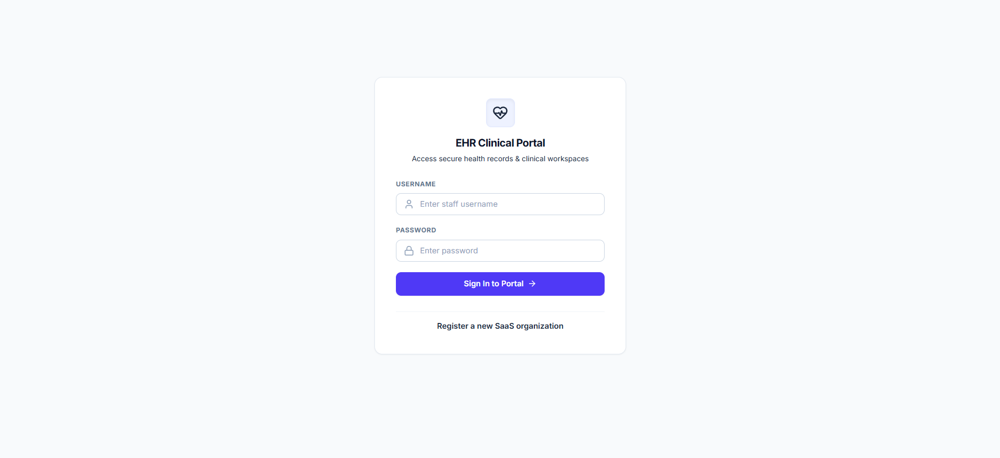
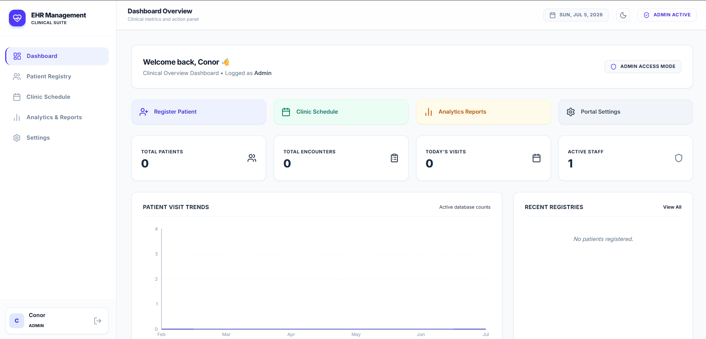
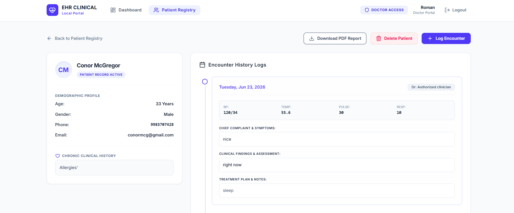

# 🏥 EHR System – Electronic Health Record Management Platform

A modern Electronic Health Record (EHR) platform built using the MERN Stack. The system helps healthcare providers manage patient records, clinical encounters, authentication, and healthcare workflows through a secure and responsive web application.

---

## 🚀 Live Demo

🌐 Frontend: https://ehr-system-xi.vercel.app

⚙️ Backend API: https://ehr-system-9e0d.onrender.com

---

# 📌 Project Overview

The EHR System was developed to digitize healthcare record management and reduce dependence on manual paperwork.

The platform allows healthcare professionals to:

* Register and manage patients
* Maintain medical histories
* Record clinical encounters
* Generate patient reports
* Securely access healthcare data
* Manage healthcare workflows through a centralized dashboard

---

# ✨ Core Features

## 🔐 Authentication & Security

* JWT Authentication
* Password Hashing with bcrypt
* Protected API Routes
* Secure User Sessions
* Role-Based Access Control

---

## 👨‍⚕️ User Management

Supported Roles:

* Doctor
* Receptionist

Capabilities:

* Secure Login
* Role-Based Permissions
* User Profile Access

---

## 🏥 Patient Management

* Register New Patients
* Update Patient Information
* Search Patients
* View Patient Details
* Store Medical History

---

## 📋 Clinical Encounter Management

Each encounter stores:

* Symptoms
* Diagnosis
* Vitals
* Clinical Notes
* Visit Date

Features:

* Create Encounters
* View Encounter History
* Track Patient Visits

---

## 📄 PDF Report Generation

Generate downloadable patient reports including:

* Patient Information
* Medical History
* Encounter Records
* Diagnosis Information
* Clinical Notes

---

## 📝 Audit Logging

The system records important actions such as:

* User Login
* Patient Registration
* Patient Updates
* Encounter Creation

This improves accountability and activity tracking.

---

## 🎨 Modern User Interface

* Responsive Design
* Clean Dashboard
* Search Functionality
* Professional Layout
* Tailwind CSS Styling

---

# 🛠️ Technology Stack

## Frontend

* React.js
* Vite
* Tailwind CSS
* JavaScript

## Backend

* Node.js
* Express.js
* MongoDB Atlas
* Mongoose

## Authentication

* JWT
* bcrypt

## Deployment

* Vercel
* Render

---

# 🏗️ System Architecture

```text
Frontend (React + Vite)
          │
          ▼
JWT Authentication
          │
          ▼
Express REST API
          │
          ▼
MongoDB Atlas Database
```

---

# 📂 Project Structure

```bash
EHR-System

backend
├── config
├── middleware
├── models
├── routes
├── server.js

frontend
├── src
│   ├── components
│   ├── pages
│   ├── utils
│   └── services

screenshots

README.md
```

---

# 📸 Application Screenshots

## Login Page

Displays secure user authentication with JWT-based login.



---

## Dashboard

Provides quick access to patient statistics and healthcare workflows.



---

## Patient Registration

Allows healthcare staff to register and manage patient information.



---

# 🔑 API Modules

## Authentication

```http
POST /api/auth/register
POST /api/auth/login
GET  /api/auth/me
```

---

## Patients

```http
GET    /api/patients
POST   /api/patients
PUT    /api/patients/:id
GET    /api/patients/:id
```

---

## Encounters

```http
POST /api/encounters
GET  /api/encounters/:id
GET  /api/encounters/patient/:patientId
```

---

# ⚙️ Installation

## Clone Repository

```bash
git clone https://github.com/Shivang9983/EHR-System.git
cd EHR-System
```

## Backend Setup

```bash
cd backend
npm install
```

Create a `.env` file:

```env
PORT=5000
MONGO_URI=your_mongodb_connection_string
JWT_SECRET=your_secret_key
NODE_ENV=development
```

Run Backend:

```bash
npm run dev
```

---

## Frontend Setup

```bash
cd frontend
npm install
```

Create a `.env` file:

```env
VITE_API_URL=http://localhost:5000
```

Run Frontend:

```bash
npm run dev
```

---

# 🧠 Engineering Decisions

### Why MongoDB?

MongoDB provides a flexible document-based structure that works well for storing healthcare records.

### Why JWT?

JWT enables stateless authentication and protects secure API routes.

### Why bcrypt?

bcrypt ensures passwords are never stored in plain text.

### Why React?

React provides reusable UI components and improves frontend maintainability.

---

# 🚀 Future Roadmap

Planned improvements:

* Appointment Scheduling
* Multi-Organization Support
* Advanced Role Management
* Cloud Storage Integration
* Medical File Uploads
* Analytics Dashboard
* Docker Support
* Swagger API Documentation
* Notification System
* Healthcare Reporting Tools

---

# 📈 Learning Outcomes

Through this project I gained experience with:

* Full Stack Development
* REST API Design
* JWT Authentication
* MongoDB Data Modeling
* Backend Security
* Role-Based Access Control
* Healthcare Domain Workflows
* Deployment using Vercel and Render

---

# 👨‍💻 Author

**Shivang Kumar**

GitHub:
https://github.com/Shivang9983

---


